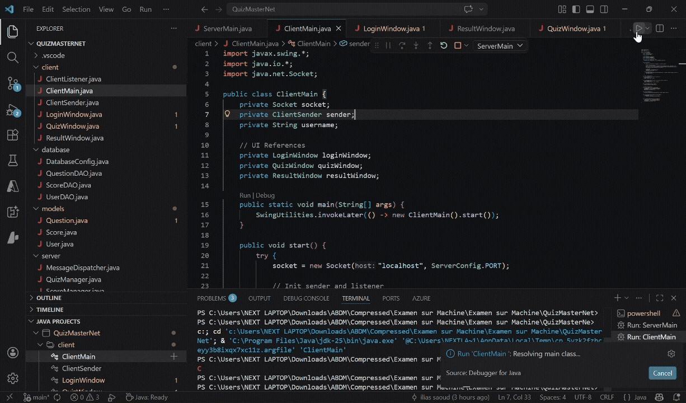
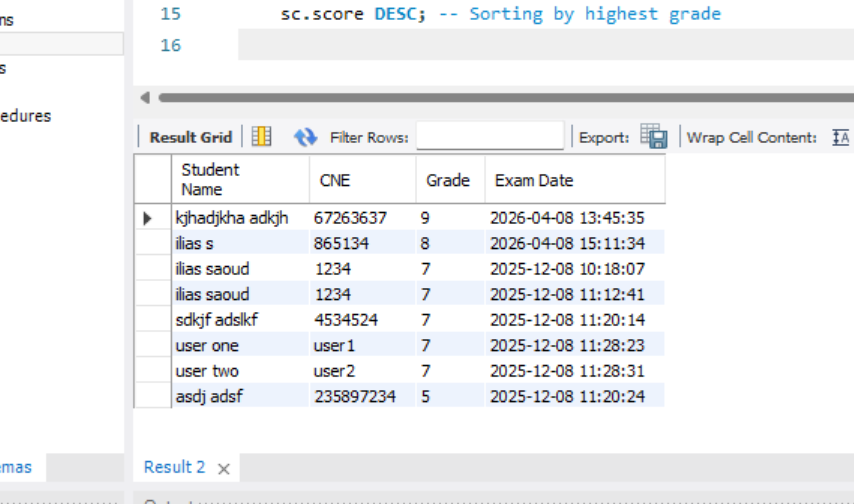

# QuizMasterNet

Ceci est un projet de système de Quiz en Java, développé dans le cadre d'un exercice de programmation réseau. L'objectif était de mettre en pratique la communication **Client-Serveur** via les Sockets et l'interaction avec une base de données **MySQL**.

Le projet utilise :

- **Java Sockets** pour la communication en temps réel entre le serveur et les clients.
- **Java Swing** pour l'interface utilisateur graphique (Login, Quiz, Résultats).
- **MySQL JDBC** pour le stockage des questions et des scores.

## Démonstration
Voici une démonstration de l'inscription et du déroulement d'un quiz :

## Table des Notes
Capture d'écran de la table des étudiants avec leurs notes :

---
*Projet réalisé pour l'ENSA Marrakech.*
